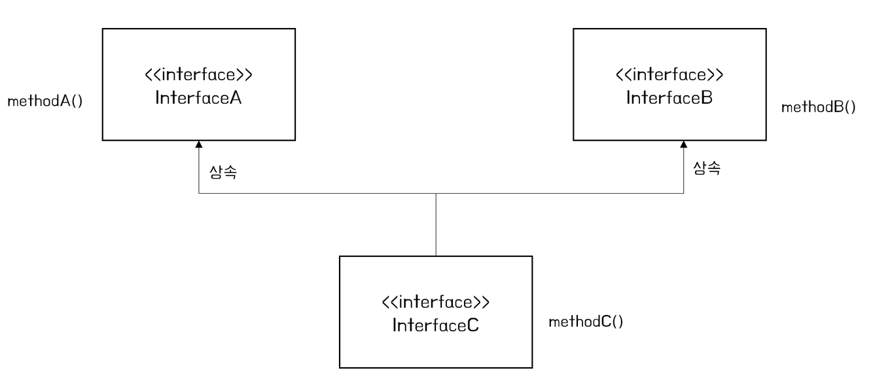
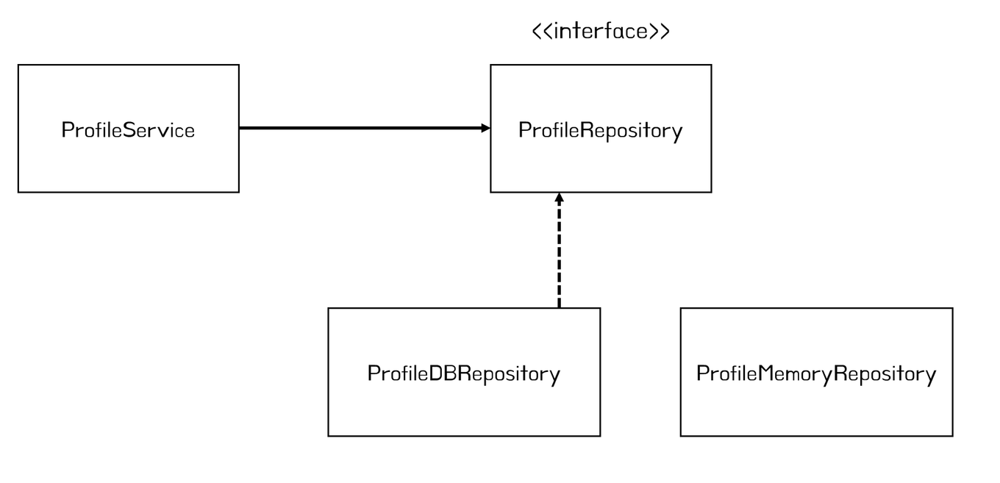

# 인터페이스 상속 #

```
public interface 하위인터페이스 extends 상위인터페이스1, 상위인터페이스2 {

}
```

<br><br>

# 인터페이스 다형성 #
*다형성* <p>: 하나의 타입에 대입되는 객체에 따라 실행 결과가 다양한 형태로 나오는 성질</p>
<p>다형성은 객체를 부품화한다.</p>



인터페이스를 사용해 메소드 호출을 하도록 코딩했다면<br>
구현 객체를 교체하기가 쉽고 빠르다!<br>

구현 객체를 교체하면서 프로그램 실행 결과가 다양해 지는 것이 **인터페이스의 다양성**
<br><br>

# 자동 타입 변환 #
구현 객체가 인터페이스 타입으로 자동 변환
```
일반클래스 변수명 = new 일반클래스();
인터페이스명 변수명 = new 구현클래스(); // 구현 객체가 인터페이스 타입으로 변환
```
<br><br>

# 객체 타입 확인 (instanceof) #
instanceof : 어떤 객체가 인터페이스 타입으로 변환되었는지 t/f로 리턴
<br><br>

# 디폴트 메소드 #
메소드명 제일 앞에 default 키워드를 붙이기<br>
디폴트 메소드는 오버라이딩 가능<br>
```
interface Predator {
	String getFood();

	// 디폴트 메소드
	default void printFood() {   
		System.out.printf("my food is %s\n", getFood());
	}
}
```
Tiger, Lion 등의 실제 클래스는 printFood() 메소드를 구현하지 않아도 공통으로 사용할 수 있다. 