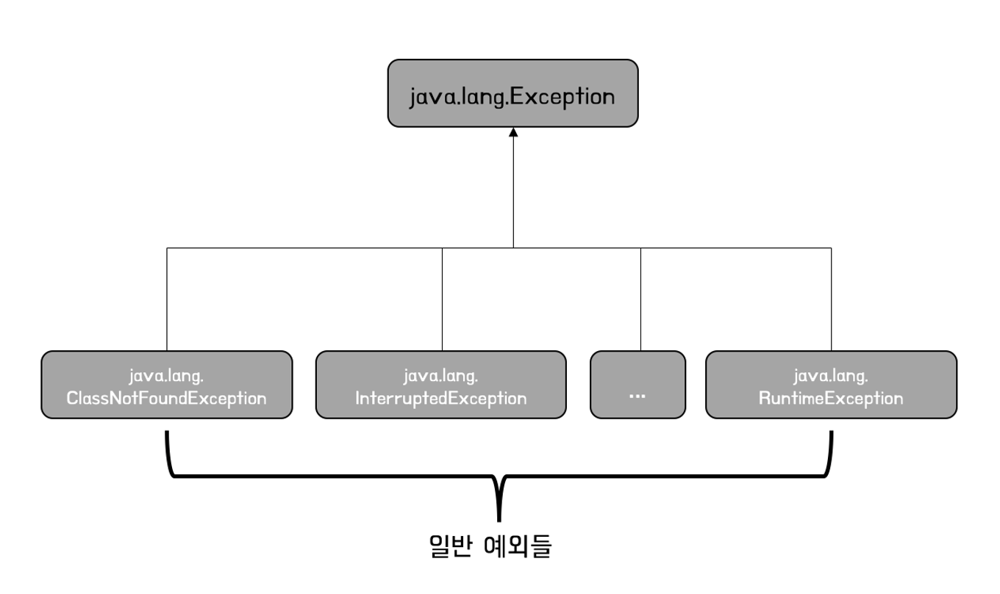
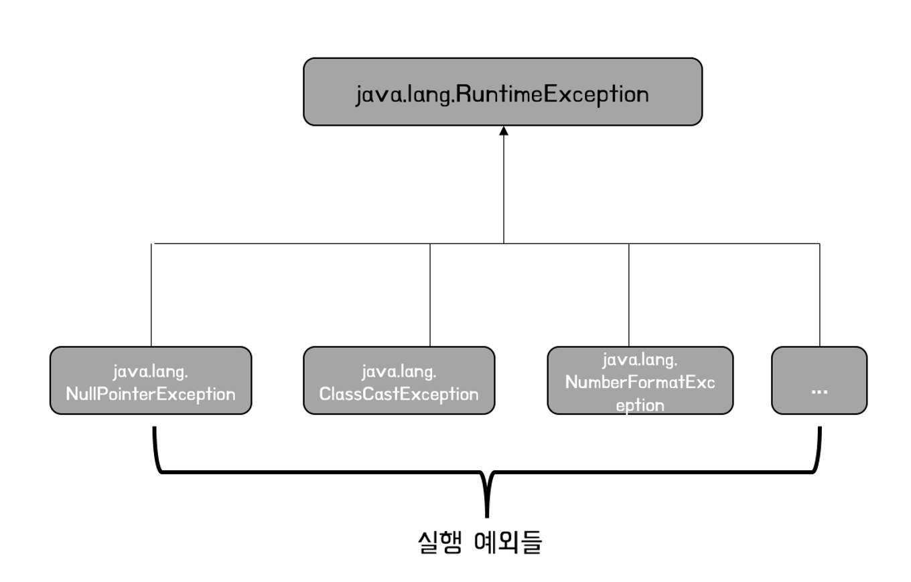
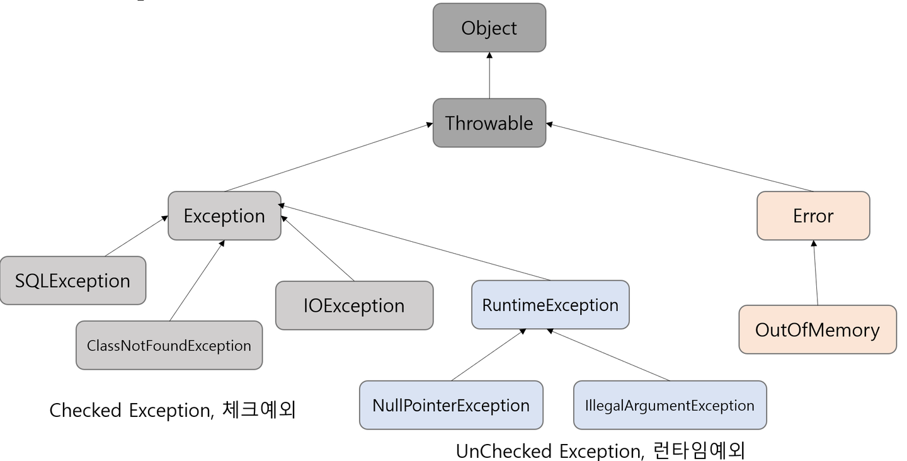

# 예외 #
**error** : 오류 발생<br>
**예외 처리** : 에러상황을 처리하여 프로그램의 정상 실행상태가 유지되도록 하는 것<br>
<br>
자바는 예외가 발생하면 **프로그램을 중단하고 오류 메세지**를 보여준다<br>
이 때, 예외처리를 해주면 ```중단하지 않고 오류메세지만 출력 후 다음 프로세스로``` 넘어간다 
<br><br>

# 예외 클래스의 계층 구조 #
예외 클래스의 종류
- 일반 예외 (Exception)
- 실행 예외 (Runtime Exception)
<br>

**두 종류 모두 예외 처리를 해야 함**
<br>

### 일반 예외 ###
== 컴파일러 체크 예외 <br>
컴파일 하는 과정에서 예외 처리 코드가 필요한지 검사함 <br>
예외 처리 코드가 없다면 컴파일 오류 발생<br>
### 실행 예외 ### 
컴파일 과정에서 예외 처리 코드를 검사하지 않는 예외<br>


<br><br>

- Object : 예외의 최상위 부모
- Throwable : 최상위 예외
- Exception : 컴파일러가 체크하는 일반 예외
- RuntimeException : 컴파일러가 체크하지 않는 실행 예외
- Error : 메모리 부족이나 심각한 시스템 오류같은 복구 불가능한 예외, 개발자가 잡을 수 없는 예외

<br><br>

# try-catch #
**기본 구조1**
```
try {
    수행할 문장1;
    수행할 문장2;
} 

catch(예외1) {
    수행할 문장A;
    수행할 문장B;
} 

catch(예외2) {
    수행할 문장a;
    수행할 문장b;
}
```
<br>

**기본 구조2**
<p>예외1, 2 중 하나라도 해당되면 A문장 실행</p>

```
try {
    수행할 문장1;
    수행할 문장2;
}

catch (예외1 | 예외2) {
    수행할 문장A;
}
```
<br><br>

# 다중 catch문 #
**상위 예외클래스가 하위 예외클래스보다 아래에 위치해야 한다!**
```
try {
    (ArrayIndexOutOfBoundsException 발생)

    (NumberFormatException 발생)
}

catch(ArrayIndexOutOfBoundsException e) { // 일단 범위 초과 예외를 처리한 후
    예외처리문1;
}

catch(Exception e) { // 나머지 예외들(더 범위가 큼) 처리
    예외처리문2;
}
```
<br><br>

# finally #
**finally**
: 어떤 예외가 발생하더라도(발생하지 않아도) 반드시 실행되게 함
<br><br>

# 사용자 정의 예외 클래스 #
자바 표준 API 예외 외에도 예외를 사용자가 직접 정의할 수 있다 <br>
사용자 정의 예외 클래스도 ```Exception```으로 끝나는 이름이 좋다

**사용자 정의 예외를 일반 예외로 선언**
```
public class XXXException extends Exception {
	public XXXException() {}
	public XXXException(String message) {
		super(message);
	}
}
```

또는 <br>
**사용자 정의 예외를 실행 예외로 설정**
```
public class XXXException extends RuntimeException {
	public XXXException() {}
	public XXXException(String message) {
		super(message);
	}
}
```
- 사용자 정의 예외도 필드, 생성자, 메소드 선언을 포함할 수 있다
- 하지만 대부분 생성자 선언만을 포함함
- 생성자는 두 개를 선언하는 것이 일반적이다
  - 1 매개변수가 없는 기본 생성자 <br>```public XXXException(){}```
  - 2 예외 발생 원인 메세지를 전달하기 위해 String 타일의 매개변수를 갖는 생성자<br>catch{}블록의 예외 처리 코드에서 이용하기 위해 예외 메세지를 만드는 것이다.<br>```public XXException(String message){super(message);}```

<br><br>

# 예외 발생시키기 #
**기본생성자** <br>
```throw new XXXException;```
<br> 혹은 <br>

**throws를 이용해 해당 예외를 발생시키는(던져주는) 메소드** <br>
```throw new XXXException("메시지");``` <br>
- 예외 발생 코드를 가진 메소드는 자기 내부에서 try-catch로 예외를 처리할 수도 있지만 <br>
- 대부분 **자신을 호출한 곳에서** 예외를 처리하도록 **throws**로 예외를 떠넘긴다.
- 따라서 throws 키워드를 포함한 메소드느 호출한 곳에서 아래와 같은 예외처리를 해줘야 함
  ```
    try{
        method();
    } catch(XXXException e){
        예외 처리 코드;
    }
  ```
  <br><br>
  ## printStackTrace ##
  - 예외 발생 코드를 추적해 모두 콘솔에 출력하는 역할
  - 어떤 예외가 어디서 발생했는지 알려줌
  
  <br><br>
  ## throw와 throws의 차이 ##
  - **throw**
    - 메소드 내에서 예외를 발생시킬 때 사용함
    - ```throw new BalanceInsufficientException()```
  - **throws**
    - 메소드 선언부에 사용
    - 해당 메소드가 처리하지 않은 예외를 호출자에게 전달
    - ```public void withdraw(int money) throws BalanceInsufficientException```