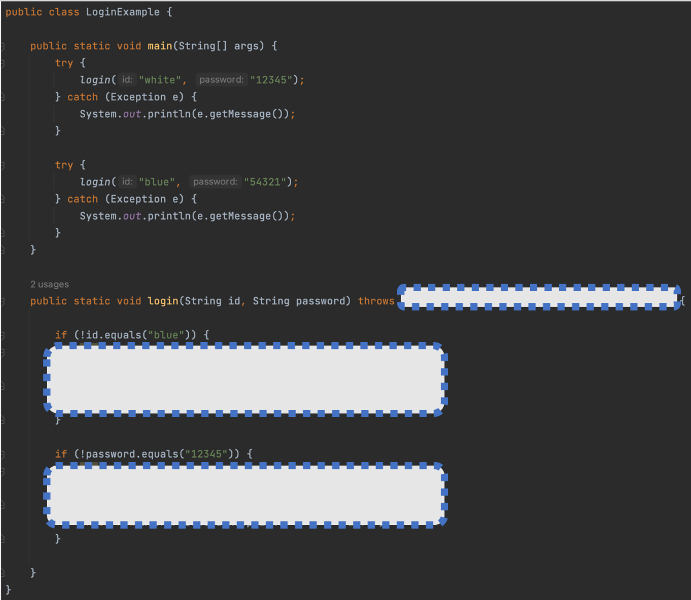
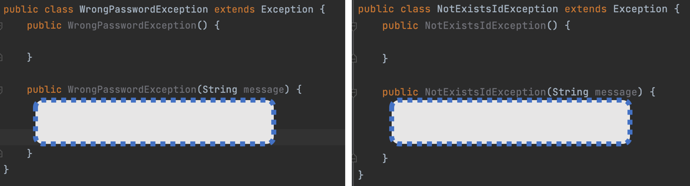

### 7. 로그인 기능을 Member 클래스의 login() 메소드에서 구현하려고 합니다. 존재하지 않는 ID를 입력했을 경우 `NotExistsIdException`을 발생시키고, 잘못된 패스워드를 입력했을 경우 `WrongPasswordException`을 발생시키려고 합니다. `LoginExample`의 실행 결과를 보고 빈칸을 채워보세요.

<LoginExample 실행결과>

```java
// LoginExample의 실행결과
아이디가 존재하지 않습니다.
패스워드가 틀립니다.
```

<LoginExample 빈칸 채우기>
<br>


<br><br>
<NotExistsIdException, WrongPasswordException 클래스 빈칸 채우기>
<br>

