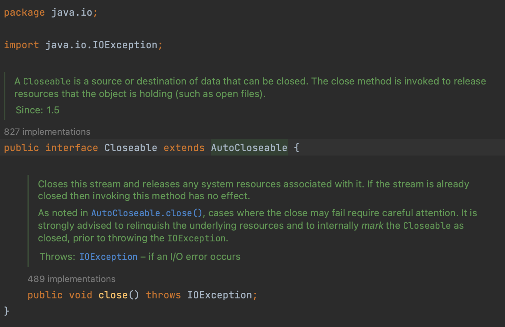

# 자동 리소스 닫기 #
## try - with - resource ##

try - with - resource를 사용하면 ***예외 발생 여부와 상관 없이*** <br>
사용했던 리소스 객체(스트림, 입출력, 서버소켓, ...)의 close()를 호출해 안전하게 리소스를 닫아준다. <br>
- try-with-resource를 사용하면 명시적으로 close()를 호출하지 않아도 된다
- try블록이 정상적으로 실행을 완료했거나 중간에 예외가 발생하면
- 자동으로 BufferedReader의 close()메소드가 호출된다
 <br><br>

```
try (BufferedReader reader = new BufferedReader(new FileReader("filename.txt"));){
    br = new BufferedReader(new FileReader("filename.txt"));
    br.readLine();
    br.close();
} catch (IOException e) {
    // 예외 처리;
}
```
 <br><br>

## try - with - resource 사용 조건 ##
리소스 객체가 ```java.lang.AutoCloseable```인터페이스를 구현하고 있어야 한다. <br>
