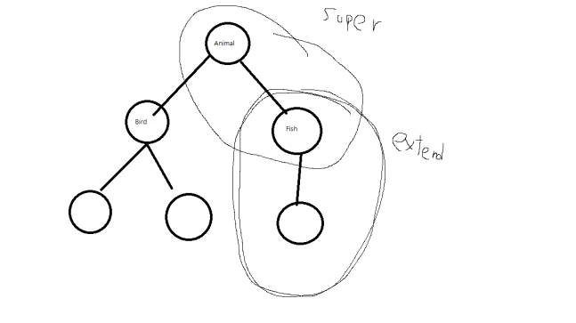

# 제네릭 메소드 #
***제네릭 메소드*** : 매개 타입과 리턴 타입으로 타입 파라미터를 갖는 메소드 <br>
## 선언
- 리턴 타입 앞에 ```<>```기호를 추가하고 타입 파라미터를 쓰고,
- 리턴 타입과 매개 타입으로 타입 파라미터를 사용한다
#### 형식
```
public <타입파라미터, ...> 리턴타입 메소드명(매개변수, ...) {
    ...
}
```
#### 예시
```
public <T> Box<T> boxing(T t) {
    ...
}
// 리턴 타입 : 제네릭타입 Box<T>
```
 <br> <br>

## 호출
#### 형식
```
리턴타입 변수 = 메소드명(매개값);
```
#### 형식
```
Box<Integer> box = Box(100);
```
 <br> <br>

# 제한된 타입 파라미터
## <T extends 최상위타입>
 : 타입 파라미터에 구체적인 타입을 제한함 <br>

**선언**
```
public <T extends 상위타입> 리턴타입 메소드명(매개변수, ...) {
    ...
}
```
 <br> <br>

# 와일드카드 타입 ? 
## <?>, <? extends ...>, <? super ...>
코드에서의 ```?```를 '와일드카드'라고 한다

- **제네릭타입 <?>** : *제한 없음*
  - 타입 파라미터를 대치하는 타입에 모든 클래스, 모든 인터페이스 타입이 올 수 있음
- **제네릭타입 <? extends 상위타입>** : *상위 클래스 제한*
  - 타입 파라미터를 대치하는 타입에 상위 타입이나 하위 타입만 올 수 있음
- **제네릭타입 <? super 하위타입>** : *하위 클래스 제한*
  - 타입 파라미터를 대치하는 타입에 하위 타입이나 상위 타입이 올 수 있음

 <br> <br>

# 제네릭 타입 상속
제네릭 타입도 부모 클래스가 될 수 있다. <br>
아래는 ***Product<T, M>을 상속한 ChildProduct<T, M>***
```
public class ChildProduct<T, M> extends Product<T, M> {
}
```
<br><br>
자식 제네릭 타입은 추가적으로 타입 파라미터를 가질 수 있다. <br>
아래는 ***자식의 타입 파라미터를 추가***
```
public class ChildProduct<T, M, C> extends Product<T, M> {
}
```
<br><br><br>

# 제네릭 인터페이스
제네릭 인터페이스를 구현한 클래스도 제네릭 타입이 된다<br>
아래는 ***제네릭 인터페이스*** 
```
public interface Storage<T> {
  void add(T item, int index);

  T get(int index);
}
```
<br><br>
아래는 제네릭 인터페이스 Storage<T>를 구현한 <br>
***StorageImpl 제네릭 타입 클래스***
```
public class StorageImpl<T> implements Storage<T> {
  private T[] array;

  public StorageImpl(int capacity) {
    array = (T[]) (new Object[capacity]);
  }

  @Override
  public void add(T item, int index) {
    array[index] = item;
  }

  @Override
  public T get(int index) {
    return array[index];
  }
}
```