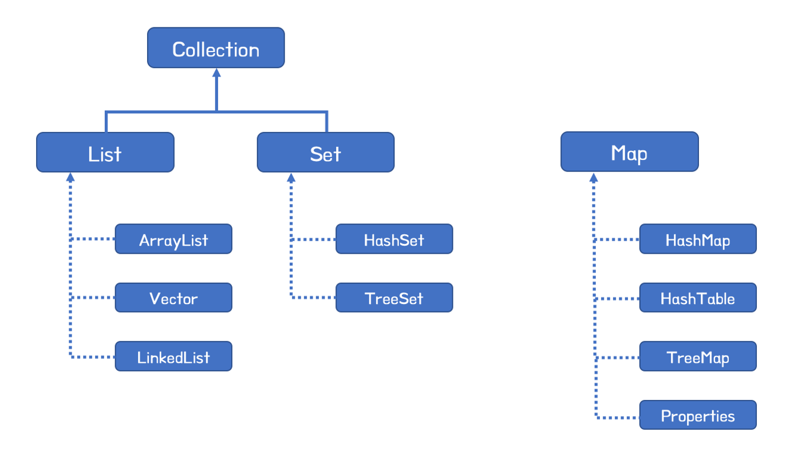
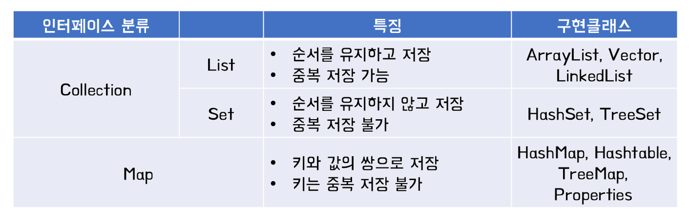

# Collection
## 컬렉션
***사전적 의미*** : 요소를 수집해서 저장하는 것 <br>
***ex*** : 배열(Array) <br>
 <br>
배열은 쉽게 생성, 사용할 수 있지만 <br>
저장할 객체 수를 배열 생성 시에 결정하므로 <br>
불특정 다수의 객체를 저장할 때는 적절치 않다. <br> <br>
또한, 객체를 삭제했을 때, <br>
해당 인덱스가 비는 문제도 있다. <br> <br> <br>
자바는 배열의 이러한 문제점을 해결하고 <br>
객체들을 효율적으로 추가, 삭제, 검색할 수 있도록 <br>

```java.util```패키지에 컬렉션관련 인터페이스와 클래스를 넣어놓았다! <br> <br>
 <br>

***주요 인터페이스*** : ```List```, ```Set```, ```Map```  <br>
- List 인터페이스를 구현한 클래스
  - ```ArrayList```, ```Vector```, ```LinkedList```
- Set 인터페이스를 구현한 클래스
  - ```HashSet```, ```TreeSet```
- Map 인터페이스를 구현한 클래스
  - ```HashMap```, ```HashTable```, ```TreeMap```, ```Properties``` 

<br><br>

***List***와 ***Set***은 객체를 추가, 삭제, 검색하는 방법이 비슷<br>
이 인터페이스들의 공통된 메소드만 보아 Collection 인터페이스로 정의함<br><br>

***Map***은 키-값을 쌍으로 관리하는 구조 <br><br>
