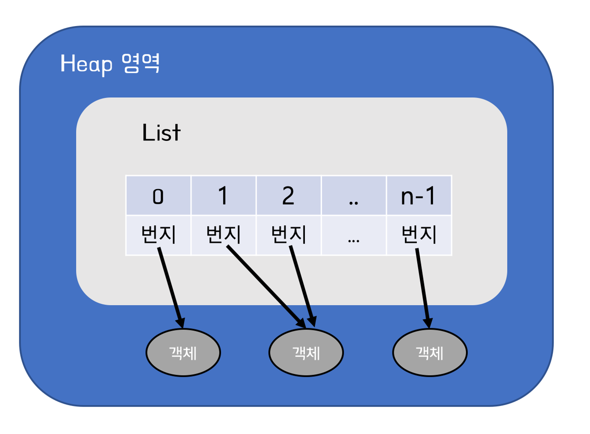
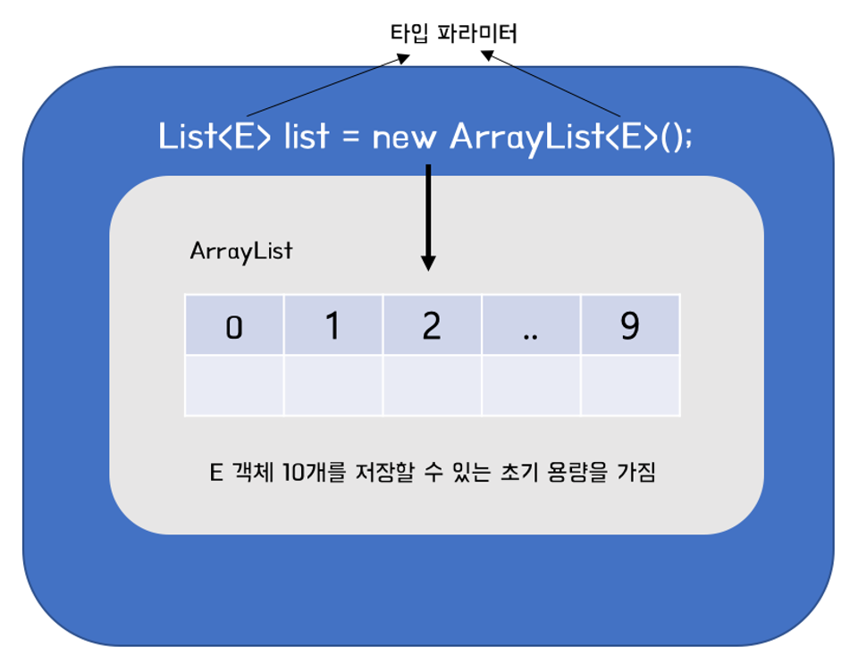

# List
## List
객체를 일렬로 늘어놓은 구조 <br>

- 객체 자체를 저장하는 게 아니라
- 객체의 주소를 저장하고, 이를 참조한다.
<br> <br>

- null도 저장이 가능하다
- 이 때, 해당 인덱스는 객체를 참조하지 않는다.
<br><br>


<br><br><br>

***예시*** : 저장타입을 String으로 정해놓고 추가, 검색, 삭제

```java
List<String> list = ...;
list.add("adam");
list.add(1, "bob");
String str = list.get(1);
list.remove(0);
list.remove("bob");
```
<br><br>

***예시*** : 전체 객체를 하나씩 반복하여 저장된 객체 얻기
```java
List<String> list = ...;
for (int i=0; i<list.size; i++) {
    String str = list.get(i); // 인덱스에 저장된 String 객체 가져오기
}
```
<br><br>

***예시*** : 인덱스 번호가 필요 없을 땐 ```향상된 for문```
```java
for (String str : list) {

}
```
<br><br>

***List 컬렉션에서 공통적으로 사용 가능한 List 인터페이스의 메소드*** <br>
인덱스로 객체 관리를 하기 때문에 인덱스를 매개값으로 갖는 메소드가 많습니다.

| 기능 | 메소드 | 설명 |
| --- | --- | --- |
| 객체 추가 | boolean add(E e) | 주어진 객체를 맨 끝에 추가 |
|  | void add(int index, E element) | 주어진 인덱스에 객체를 추가 |
|  | set(int index, E element) | 주어진 인덱스에 저장된 객체를 주어진 객체로 바꿈 |
| 객체 검색 | boolean contains(Object o) | 주어진 객체가 저장되어있는지 여부 |
|  | E get(int index) | 주어진 인덱스에 저장된 객체를 리턴 |
|  | isEmpty() | 컬렉션이 비어있는지 여부 |
|  | int size() | 저장되어 있는 전체 객체 수 리턴 |
| 객체 삭제 | void clear() | 저장된 모든 객체를 삭제 |
|  | E remove(int index) | 주어진 인덱스에 저장된 객체를 삭제 |
|  | boolean remove(Object o) | 주어진 객체를 삭제 |
<br><br>

## ArrayList
List 인터페이스의 구현 클래스 <br>
ArrayList에 객체를 추가하게 되면 객체는 인덱스로 관리된다 <br><br>

**일반 배열**과 **ArrayList**는
- 인덱스로 객체를 관리한다는 점에서 같지만
- 배열은 생성할때 크기를 고정, 사용 중 크기 변경 불가능하지만
- ArrayList는 용량을 초과한 객체에게는 용량을 자동으로 늘려준다는 차이점

<br>
  <br> <br>
기본 생성자로 ArrayList를 생성하면  <br>
내부에 10개의 객체를 저장할 수 있는 초기 용량을 갖게 된다. <br><br>
저장 객체 수가 늘어나면 용량이 자동으로 늘지만, <br>
처음부터 용량을 크게 잡고 싶다면,  <br>
크기를 매개값으로 넣는 생성자를 쓰자! <br>

```java
List<String> list = new ArrayList<String>(30);
// String 객체 30개를 저장할 수 있는 용량
```

ArrayList에 객체를 ***추가***하면 <br>
인덱스 0부터 차례로 저장된다<br><br>
특정 인덱스의 객체를 ***제거***하면,<br>
바로 뒤 인덱스부터 마지막 인덱스까지 모두 앞으로 1씩 당겨진다<br><br>
특정 인덱스에 객체를 ***삽입***하면,<br>
바로 뒤 인덱스부터 마지막 인덱스까지 뒤로 1씩 밀려난다.<br><br>

***따라서 빈번한 삭제, 삽입 발생 시, ArrayList의 사용은 적절치 않다!*** <br>
이 경우, LinkedList를 사용하자!<br><br>

인덱스 검색 맨 마지막에 객체를 추가하는 경우에는, <br>
